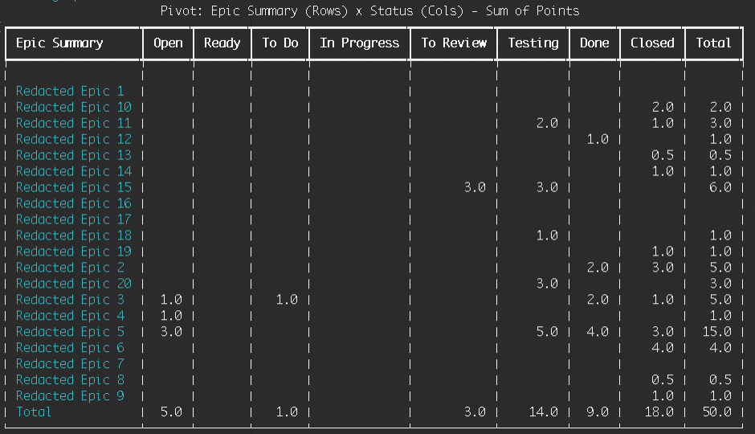

# Terminal Jira CLI

A powerful, aesthetic, and flexible terminal application for interacting with Jira. Built with Python, Rich, and Pandas.



## Features

- **Search**: Flexible JQL searching with formatted table output.
- **Grouping**: Aggregate story points and counts by status, assignee, or epic.
- **Pivot Tables**: Generate matrix reports (e.g., Epics vs Status) directly in your terminal.
- **Management**: Create and edit issues with support for custom fields (Story Points, Epic Links).
- **Sprint Management**: Add or remove issues from sprints by name.
- **Aesthetic**: Rich-formatted output with panels, colors, and progress bars.
- **Anonymization**: Demo-ready mode to redact sensitive summaries.
- **Status Ordering**: Explicitly control the order of statuses in reports via `.env`.
- **Command Aliases**: Reusable command shortcuts defined in a `.cmd` file.
- **Configurable**: Works with Jira Data Center and Jira Cloud via environment variables.

---

## 1. Setup

### Installation
Clone the repository and install dependencies:

```bash
# Create and activate virtual environment
python3 -m venv .venv
source .venv/bin/activate

# Install dependencies
pip install -r requirements.txt
```

### Configuration
Copy the example environment file and fill in your Jira details:

```bash
cp .env.example .env
```

Edit `.env` with:
- `JIRA_URL`: Your Jira instance URL.
- `JIRA_USERNAME`: Your username (or email for Cloud).
- `JIRA_PASSWORD`: Your password (or API Token for Cloud).
- `FIELD_*`: Custom field IDs for your specific Jira instance.

---

## 2. Usage

Available commands: `search`, `view`, `create`, `edit`.

### Search issues
```bash
# Basic search
python terminal-jira.py search --jql "project = PROJ"

# Search with sorting
python terminal-jira.py search --jql "project = PROJ" --sort status

# Search with Epic summaries
python terminal-jira.py search --jql "project = PROJ" --epic-name
```

### Grouping & Aggregation
```bash
# Group by Status (Count + Total Points)
python terminal-jira.py search --jql "project = PROJ" --group-by Status

# Group by Epic and Status
python terminal-jira.py search --jql "project = PROJ" --epic-name --group-by "Epic Summary,Status"
```

### Pivot Tables
Generate a matrix of Story Points:
```bash
python terminal-jira.py search --jql "project = PROJ" --epic-name --pivot-rows "Epic Summary" --pivot-cols "Status" --pivot-values "Points"
```

### Detailed View
```bash
python terminal-jira.py view PROJ-123
```

### Create & Edit
```bash
# Create
python terminal-jira.py create --project PROJ --summary "Task Name" --type Task

# Edit
python terminal-jira.py edit PROJ-123 --points 5 --status "In Progress"

# Sprint Management
python terminal-jira.py edit PROJ-123 --sprint "Sprint 5"
python terminal-jira.py edit PROJ-123 --clear-sprint
```

### Command Aliases (`--cmd`)
You can define reusable command shortcuts in a `.cmd` file located in the root directory.

```bash
# Run a predefined alias
python terminal-jira.py --cmd my-sprint-report
```

See [4. Command Aliases](#4-command-aliases) for setup details.

---

## 3. Advanced Configuration

### Jira Cloud Support
If using Jira Cloud, update the API version in your `.env`:
```bash
JIRA_API_SEARCH_ENDPOINT=/rest/api/3/search
JIRA_API_ISSUE_ENDPOINT=/rest/api/3/issue
```

### Demo Mode
Redact ticket summaries and descriptions for public presentations:
```bash
JIRA_ANONYMIZE=True python terminal-jira.py search --jql "..."
```

### Custom Status Ordering
Control the display order of statuses in Group By and Pivot Tables:
```bash
# In your .env file
STATUS_ORDER=Open, To Do, Ready, In Progress, To Review, Testing, Done, Closed
```
Statuses not in the list will appear at the end.

---

## 4. Command Aliases

Define aliases in a file named `.cmd` in the root of the project.

**Format:**
```ini
alias_name = full arguments for terminal-jira.py
```

**Example `.cmd` file:**
```ini
# Status summary for a specific sprint
sprint-report = search --jql "sprint = 'Sprint 2'" --group-by status --epic-name

# Pivot table for project workload
work-pivot = search --jql "project = PROJ" --pivot-rows "Epic Link" --pivot-cols "Status" --pivot-values "Points"
```

**Usage:**
```bash
python terminal-jira.py --cmd sprint-report
```

> [!TIP]
> You can create a `.cmd` file by copying the provided example: `cp .cmd.example .cmd`
